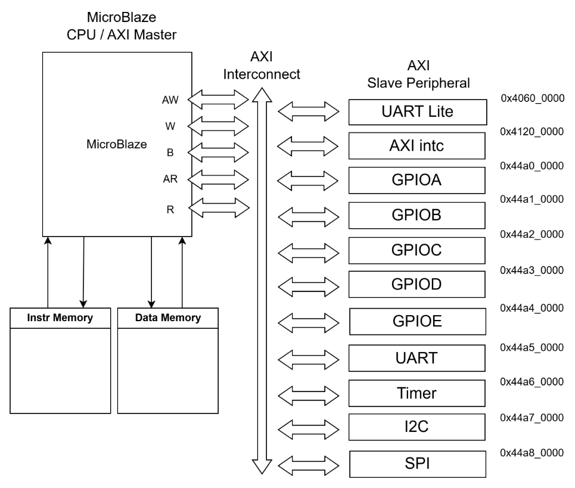
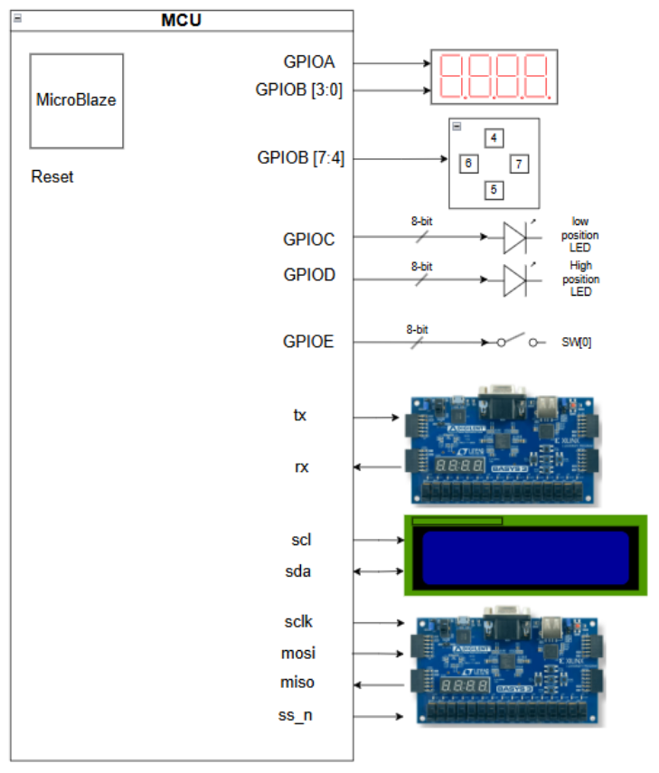
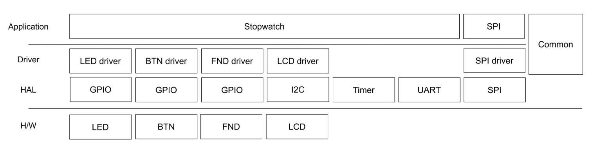
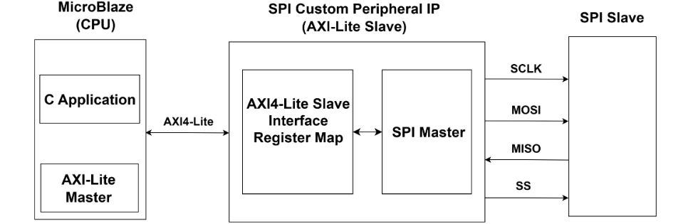
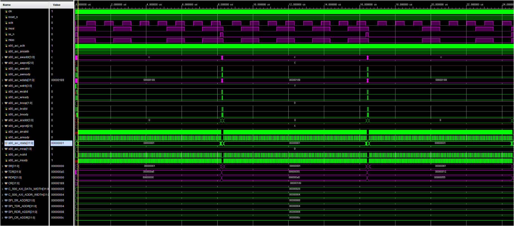
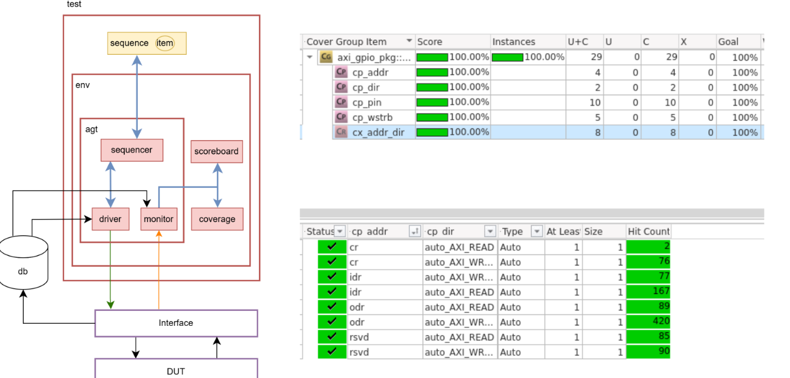
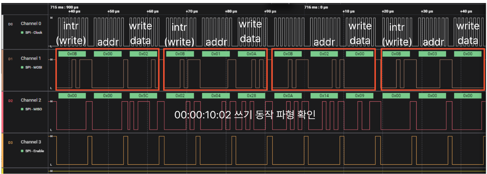
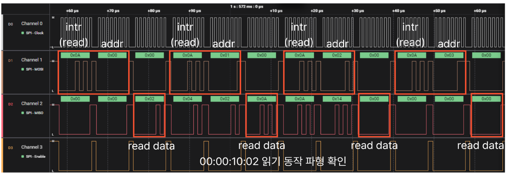
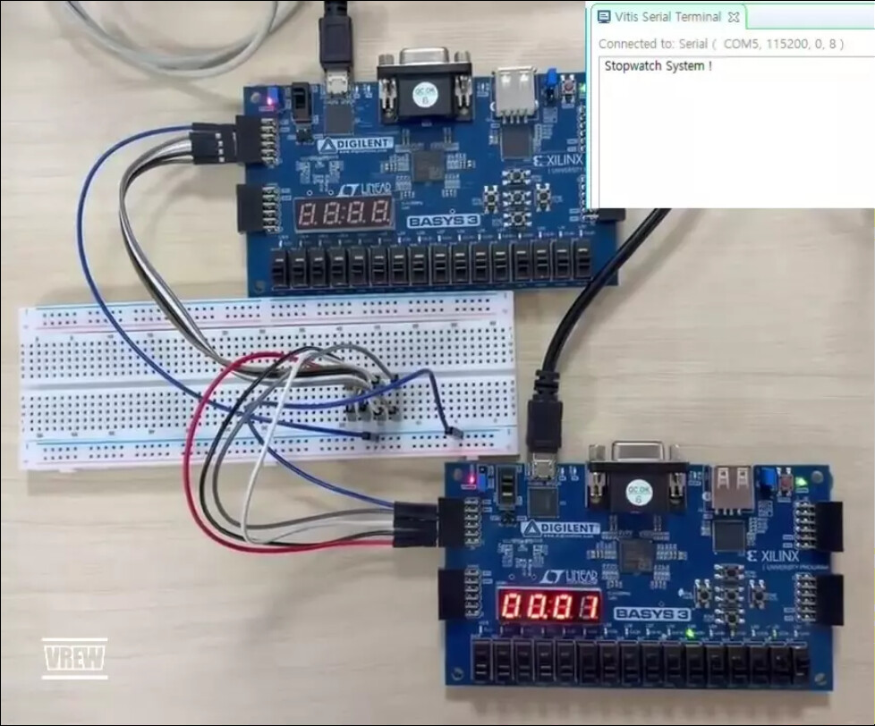

# AXI_Peripheral

MicroBlaze 기반 SoC에 GPIO, Timer, UART, I2C, SPI 기능 모듈을 AXI4-Lite로 통합하고, C Application에서 Memory-Mapped Register를 통해 제어한 프로젝트입니다.

Vivado에서 하드웨어 플랫폼과 Custom IP를 구성하고, Vitis에서 Application–Driver–HAL 구조의 소프트웨어를 작성했습니다. GPIO는 SystemVerilog/UVM으로 검증했으며, SPI는 AXI Simulation과 Basys 3 보드 간 통신까지 확인했습니다.

- 개발 기간: 2026.06.22 ~ 2026.06.30
- 대상 보드: Digilent Basys 3
- Processor: Xilinx MicroBlaze
- Bus Interface: AXI4-Lite
- 개발 환경: Vivado 2020.2, Vitis, VCS, Verdi, UVM 1.2
- 사용 언어: Verilog, SystemVerilog, C

## 프로젝트 목표

- AXI4-Lite의 AW, W, B, AR, R 채널과 Handshake 동작 이해
- 여러 종류의 기능 모듈을 하나의 AXI Address Space에 통합
- Base Address, Offset, Bit Field를 기준으로 RTL과 Firmware 연결
- Application, Driver, HAL의 역할을 구분한 C Software 구성
- Simulation, UVM, FPGA 보드 측정을 통한 단계별 검증

## 주요 결과

- GPIO, Timer, UART, I2C, SPI Custom IP 설계 및 AXI4-Lite 연결
- MicroBlaze 기반 Stopwatch Application 구현
- SPI Mode 0 기반 Master–Slave 통신과 Slave RAM Write/Read 구현
- GPIO UVM의 모든 Coverpoint와 Cross Coverage 100% 달성
- Logic Analyzer에서 Command, Address, Data와 SCLK, MOSI, MISO, SS_n 확인
- Stopwatch 데이터 00:00:10.02의 Slave RAM 저장값과 Read 결과 일치 확인

## SoC 구조

MicroBlaze가 AXI Master로 동작하고, AXI Interconnect가 주소를 해석해 각 AXI Slave로 Read/Write 요청을 전달합니다. 장치마다 독립적인 Address 영역을 사용하지만 C Software에서는 동일한 Memory-Mapped Register 접근 방식으로 제어합니다.

### Address Map

- Local Memory: 0x0000_0000 ~ 0x0001_FFFF, 128 KiB
- AXI UARTLite: 0x4060_0000 ~ 0x4060_FFFF
- AXI Interrupt Controller: 0x4120_0000 ~ 0x4120_FFFF
- GPIOA: 0x44A0_0000 ~ 0x44A0_FFFF
- GPIOB: 0x44A1_0000 ~ 0x44A1_FFFF
- GPIOC: 0x44A2_0000 ~ 0x44A2_FFFF
- GPIOD: 0x44A3_0000 ~ 0x44A3_FFFF
- GPIOE: 0x44A4_0000 ~ 0x44A4_FFFF
- Custom UART: 0x44A5_0000 ~ 0x44A5_FFFF
- Timer: 0x44A6_0000 ~ 0x44A6_FFFF
- I2C: 0x44A7_0000 ~ 0x44A7_FFFF
- SPI: 0x44A8_0000 ~ 0x44A8_FFFF

## 기능 구성

- GPIOA: FND 출력
- GPIOB: FND 선택 신호와 Button 입력
- GPIOC, GPIOD: LED 출력
- GPIOE: Switch 입력과 SPI Write/Read 모드 선택
- Timer: 1 ms System Tick과 Stopwatch 시간 갱신
- AXI UARTLite: Vitis Terminal 출력
- Custom UART: 자체 송수신 RTL과 Interrupt 제어
- I2C: Character LCD 제어
- SPI: Master–Slave 통신과 Slave RAM 접근

## Custom IP Register Map

각 Register는 32-bit이며 4 Byte 간격으로 배치했습니다.

### GPIO

- 0x00 CR: 하위 8-bit의 입출력 방향 설정, 1은 Output, 0은 Input
- 0x04 IDR: 외부 GPIO 입력값 Read
- 0x08 ODR: GPIO 출력값 Write 및 Readback

### Timer

- 0x00 TIM_CR: Timer와 Interrupt 제어
- 0x04 PSC: Prescaler 설정
- 0x08 ARR: Auto Reload 값 설정
- 0x0C CNT: Counter 값 확인

### UART

- 0x00 SR: 송신 가능 상태와 수신 데이터 유효 상태 확인
- 0x04 TDR: 송신할 1 Byte 데이터 Write
- 0x08 RDR: 수신된 1 Byte 데이터 Read
- 0x0C CR: 수신 Interrupt 활성화

### I2C

- 0x00 CTRL: I2C 동작 제어
- 0x04 DATA: 송신 데이터 Write
- 0x08 RX_DATA: 수신 데이터 Read
- 0x0C DONE: 전송 완료 상태 확인

### SPI

- 0x00 SR: BUSY와 DONE 상태 확인
- 0x04 TDR: 송신할 1 Byte 데이터 Write
- 0x08 RDR: MISO로 수신한 1 Byte 데이터 Read
- 0x0C CR: START, CPOL, CPHA, Clock Divider 설정

## Vivado Hardware와 Vitis Software

Vivado에서는 MicroBlaze, Local Memory, AXI Interconnect, Interrupt Controller와 Custom IP를 연결해 하드웨어 플랫폼을 구성했습니다. Bitstream 생성 후 XSA를 Export하고, Vitis에서 이를 기반으로 C Application을 작성했습니다.

- Application: Stopwatch 상태와 시간 데이터, SPI 저장·읽기 동작 구성
- Driver: Button, LED, FND, LCD, SPI의 장치 단위 기능 제공
- HAL: GPIO, Timer, UART, I2C, SPI의 Base Address와 Register 접근 담당
- Common: Delay, System Tick, Interrupt 처리
- Hardware: AXI Slave Register와 실제 입출력 및 통신 신호 생성

main.c는 각 모듈을 초기화하고 Stopwatch_Execute를 반복 실행합니다. 왼쪽 Button의 Release Event가 발생하면 SPI_Execute를 호출하며, GPIOE의 SW[0] 값으로 Write와 Read 동작을 선택합니다.

## SPI Custom IP

초기 구조에서는 Hardware의 SPI Master Control이 전송 Frame을 만들고 SPI Master를 직접 제어했습니다. AXI 연동 후에는 MicroBlaze C Application이 Command, Address, Data의 순서를 구성하고, AXI4-Lite Register를 통해 SPI Master Core를 제어하도록 역할을 분리했습니다.

- 동작 Mode: SPI Mode 0, CPOL 0, CPHA 0
- Data Width: 8-bit
- Bit Order: MSB First
- SCLK 생성: Clock Divider의 Half Tick 기준
- 기본 전송 절차: TDR Write → CR Start → SR BUSY Polling → RDR Read

### Slave RAM Write

- 전송 순서: Write Command 0x0B → Address → Write Data
- Address 0x00: 밀리초
- Address 0x01: 초
- Address 0x02: 분
- Address 0x03: 시

### Slave RAM Read

- 전송 순서: Read Command 0x0A → Address → Dummy Data 0x00
- Dummy Data가 MOSI로 전송되는 동안 Slave가 MISO로 RAM Data 반환
- 마지막 전송에서 갱신된 RDR 값을 최종 Read Data로 사용

### AXI Simulation

TDR에 데이터를 Write한 뒤 CR에 0x0000_0189를 Write하여 전송을 시작했습니다. 이 값은 START 1, CPOL 0, CPHA 0, Clock Divider 0x31로 구성됩니다. SR의 DONE 변화와 RDR 저장값을 확인하고, SR·TDR·RDR·CR이 각각 0x00·0x04·0x08·0x0C Offset으로 접근되는지 검증했습니다.

## GPIO UVM 검증

검증 대상은 AXI4-Lite 기반 GPIO RTL입니다. CR, IDR, ODR의 AXI Read/Write, WSTRB에 따른 Byte 갱신, CR 방향 설정에 따른 8-bit io_port 입출력을 Scoreboard에서 비교했습니다.

### 검증 환경

- Sequence와 Sequence Item: 주소, 방향, 데이터, WSTRB, 외부 GPIO 입력 생성
- Driver: AXI4-Lite 신호와 외부 GPIO 입력 구동
- Monitor: AXI Read/Write Transaction과 io_port 변화 수집
- Scoreboard: Register 기대값과 GPIO 핀 동작 비교
- Coverage: 주소, 방향, 핀, WSTRB와 주소·방향 Cross 측정

### Test Scenario

- Random Test: CR을 Input으로 설정하고 주소, 데이터, WSTRB, 외부 입력을 Random 적용
- Direct Test: 전체 Input과 Output 조건에서 대표 Pattern 14종 검증
- Full Test: ODR에 0x00 ~ 0xFF의 모든 값 적용
- Cross Test: 방향 Pattern 6종과 Data Pattern 12종을 조합한 72개 조건 검증
- Full Coverage Test: Cross, Direct, Random 500회, Full Sequence를 순차 실행

### Coverage Result

- Register 주소 cp_addr: 100%
- GPIO 방향 cp_dir: 100%
- Pin 번호 cp_pin: 100%
- Byte Strobe cp_wstrb: 100%
- 주소와 방향 cx_addr_dir: 100%
- 전체 Functional Coverage: 100%

## FPGA 보드 검증

### Write 결과

Stopwatch 시간 00:00:10.02를 다음과 같이 Slave RAM에 저장했습니다.

- Address 0x00 = 0x02, 밀리초
- Address 0x01 = 0x0A, 초
- Address 0x02 = 0x00, 분
- Address 0x03 = 0x00, 시

Logic Analyzer에서 네 개의 Write Frame이 0x0B → Address → Data 순서로 전송되고, 각 Frame 완료 시 Slave의 Write 동작이 발생하는 것을 확인했습니다.

### Read 결과

각 Address에 대해 0x0A → Address → 0x00을 전송하고, Dummy 구간의 MISO Data를 수신했습니다. Read 결과 0x02, 0x0A, 0x00, 0x00이 Write 값과 일치했으며 Vitis Terminal에도 00:00:10.02가 출력되었습니다.

## Troubleshooting

### SPI Read Data가 항상 0x00으로 수신되는 문제

- 문제: Slave RAM Write는 정상인데 Address와 관계없이 SPI Master의 RDR이 항상 0x00으로 확인됨
- 분석: Write가 정상인 점을 근거로 SCLK, MOSI, SS_n과 Command·Address 수신 경로를 제외하고 Slave의 RAM Read와 MISO 송신 경로로 범위를 축소
- 원인: Slave의 load_data가 ram[read_data]를 참조하고 있었고, Read 마지막 단계의 Dummy Data 0x00이 read_data를 덮어써 항상 ram[0]을 선택
- 수정: Address 단계에서 래치한 addr을 사용하도록 ram[read_data]를 ram[addr]로 변경
- 결과: Address 0x00 ~ 0x03의 Read 값이 직전 Write 값과 모두 일치

여러 Byte로 구성된 Transaction에서는 Command, Address, Data의 역할을 분리하고, Transaction 동안 유지되어야 하는 Address 정보를 별도 Register에 저장해야 한다는 점을 확인했습니다.

## Repository Structure

- hardware/custom_ip: GPIO, Timer, UART, I2C, SPI AXI4-Lite Custom IP
- hardware/system: MicroBlaze SoC Block Design
- hardware/constraints: Basys 3 Master XDC
- hardware/spi_slave: SPI Slave와 RAM 제어 RTL 및 XDC
- software/ap: Stopwatch와 SPI Application
- software/driver: Button, LED, FND, LCD, SPI Driver
- software/hal: GPIO, Timer, UART, I2C, SPI Register Access
- software/common: Delay와 Interrupt 공통 기능
- verification/gpio_uvm/rtl: GPIO DUT
- verification/gpio_uvm/tb: UVM Testbench
- docs/images: 구조도, Simulation, Coverage, Logic Analyzer, 보드 사진

## 실행 방법

### Vivado Hardware Platform

1. Vivado 2020.2에서 Basys 3 대상 프로젝트를 생성합니다.
2. hardware/custom_ip 경로를 IP Repository에 추가합니다.
3. hardware/system/system.bd와 hardware/constraints/Basys-3-Master.xdc를 프로젝트에 추가합니다.
4. Block Design의 Output Products와 HDL Wrapper를 생성합니다.
5. Synthesis, Implementation, Bitstream 생성을 진행하고 XSA를 Export합니다.

### Vitis C Application

1. Vivado에서 Export한 XSA로 Vitis Platform Project를 생성합니다.
2. Empty Application을 생성하고 software의 파일과 폴더를 Source에 추가합니다.
3. Application Include Path에 software 하위 경로를 추가합니다.
4. Bitstream을 Program하고 Application을 실행합니다.
5. Vitis Terminal을 115200 baud로 열어 Stopwatch와 SPI Read 결과를 확인합니다.

### GPIO UVM

1. verification/gpio_uvm/rtl의 DUT와 verification/gpio_uvm/tb의 Testbench를 Compile합니다.
2. UVM 1.2 환경에서 tb_top을 Top Module로 지정합니다.
3. axi_gpio_random_test, axi_gpio_direct_test, axi_gpio_full_test, axi_gpio_cross_test 또는 axi_gpio_full_cov_test를 선택해 실행합니다.
4. Scoreboard Error와 Functional Coverage 결과를 확인합니다.
